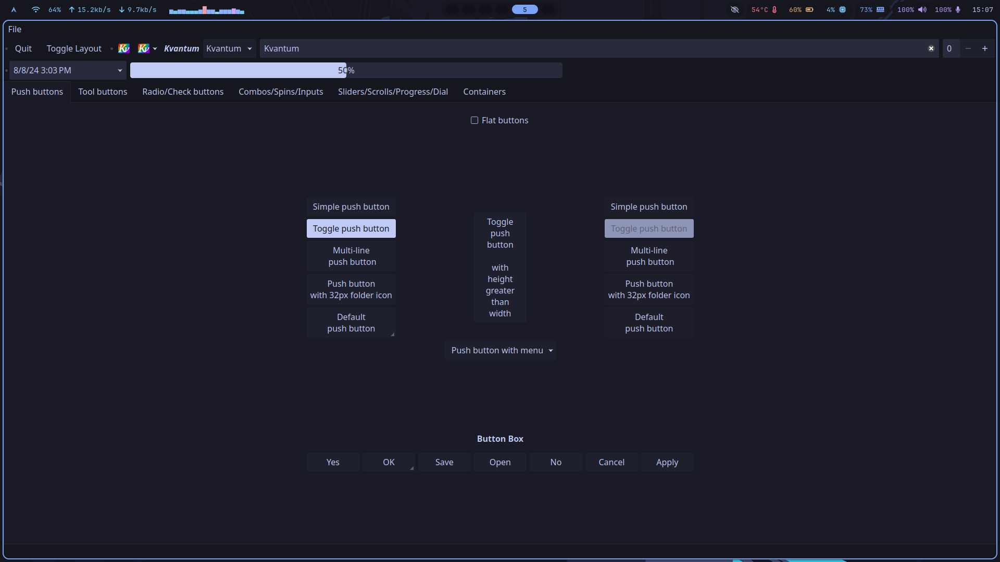
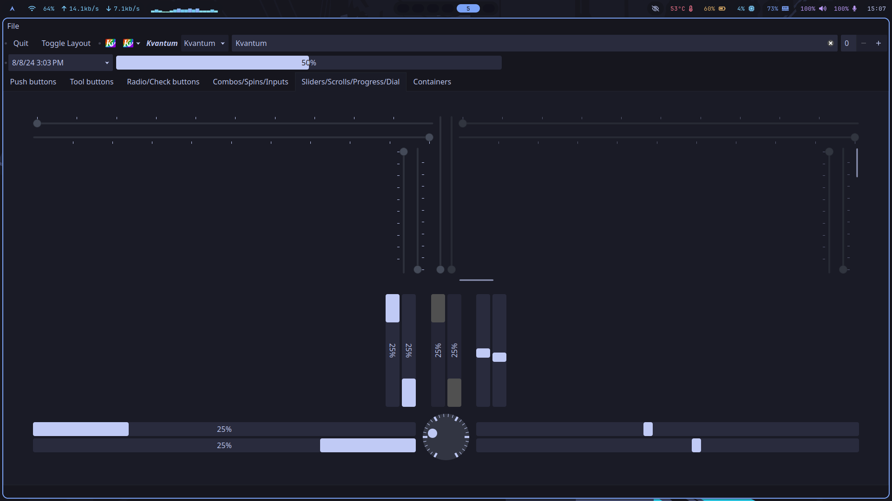

# A kvantum theme for Tokyo Night color palette

This theme uses the Tokyo Night color palette with a Kvantum theme structure.

## Attribution

This theme combines work from multiple sources:

- **Base kvconfig file**: Derived from [Catppuccin for Kvantum](https://github.com/catppuccin/Kvantum)
- **Base SVG and earlier versions**: Based on [colin-heffernan's Kvantum-Tokyo-Night-Theme](https://github.com/colin-heffernan/Kvantum-Tokyo-Night-Theme) and [0xsch1zo's modified version](https://github.com/0xsch1zo/Kvantum-Tokyo-Night-Theme)
- **Modifications**: Accent color changed to blue, borders removed from folder view, theme structure updated for Qt 6.10 compatibility

## Special thanks

- [elkrien](https://github.com/catppuccin/Kvantum) for the Catppuccin Kvantum base theme
- [colin-heffernan](https://github.com/colin-heffernan) for the original Tokyo Night Kvantum theme
- [0xsch1zo](https://github.com/0xsch1zo) for the modified version

## License

This project uses multiple licenses to respect the original sources:

- **kvconfig file** (`Kvantum-Tokyo-Night.kvconfig`): **MIT License** (derived from Catppuccin)
- **SVG files and other assets**: **GPL-3.0** (derived from Tokyo Night theme)

See `LICENSE-MIT` and `LICENSE-GPL` files for full license texts.
